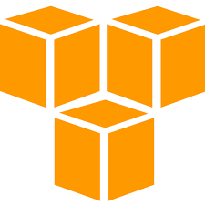

<!-- Header -->
# 🏆 Machine Learning | Data Science | Back-End Whiz

## Solid Background In
<table>
  <tr>
    <td>Mathematics</td>
    <td>Statistics</td>
    <td>Optimization</td>
    <td>Deep Learning</td>
    <td>Algorithm</td>
  </tr>
  <tr>    
    <td>Data Structure</td>
    <td>Linguistics</td>
    <td>Regression</td>
    <td>Reinforcement Learning</td>
    <td></td>
  </tr>
</table>

## Extensive Experience In

<table>
  <tr>
    <td align="center" width="96">
        
         <b>Python 
    </td>
    <td align="center" width="96">
        
         <b>C++ 
    </td>
    <td align="center" width="96">
        
       <b>C# 
    </td>
    <td align="center" width="96">
        
         <b>R 
    </td>
    <td align="center" width="96">
        
         <b>Java 
    </td>
    <td align="center" width="96">
        
         <b>PHP 
    </td>
  </tr>
  <tr>
    <td align="center" width="96">
        
       <b>PyTorch 
    </td>
    <td align="center" width="96">
        
       <b>Tensorflow 
    </td>
    <td align="center" width="96">
        
       <b>Keras 
    </td>
    <td align="center" width="96">
        
       <b>MxNet 
    </td>
    <td align="center" width="96">
        
       <b>Darknet 
    </td>
    <td align="center" width="96">
        
       <b>Paddle 
    </td>
  </tr>
  <tr>
    <td align="center" width="96">
        
       <b>OpenCV 
    </td>
    <td align="center" width="96">
        
       <b>Yolo 
    </td>
    <td align="center" width="96">
        
       <b>Vision 
    </td>
    <td align="center" width="96">
        
       <b>Matlab 
    </td>
    <td align="center" width="96">
        
       <b>Jupyter 
    </td>
    <td align="center" width="96">
        
       <b>Colab 
    </td>
  </tr>        
  <tr>
    <td align="center" width="96">
        
       <b>Kaggle 
    </td>
    <td align="center" width="96">
        
       <b>AWS 
    </td>
    <td align="center" width="96">
        
       <b>GCP 
    </td>
    <td align="center" width="96">
        
       <b>Azure 
    </td>
    <td align="center" width="96">
        
       <b>Lambda 
    </td>
    <td align="center" width="96">
        
       <b>Docker 
    </td>
  </tr>
  <tr>
    <td align="center" width="96">
        
       <b>DevOps 
    </td>
    <td align="center" width="96">
        
       <b>Django 
    </td>
    <td align="center" width="96">
        
       <b>NodeJS 
    </td>
    <td align="center" width="96">
        
       <b>Spring 
    </td>
    <td align="center" width="96">
        
       <b>Oracle 
    </td>
    <td align="center" width="96">
        
       <b>MongoDB 
    </td>    
  </tr>
</table>
